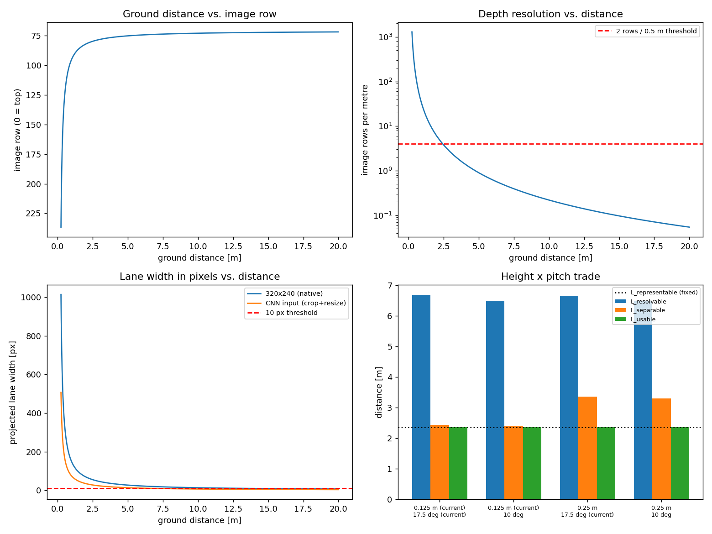

# Camera resolvability report
Generated by `tools/camera_resolvability.py`. Measures how far ahead the camera can actually resolve the lane, independent of whether `camera_visibility.py` counts a point as "visible" -- see the parent PR's finding #1 (`LOOKAHEAD_M` vs these limits).
## Current camera (height=0.125 m, pitch=17.5 deg)
- **L_resolvable** (lane width < 10 px at CNN input resolution): **6.69 m**
- **L_separable** (two points 0.5 m apart fall under 2 image rows apart): **2.44 m**
- **L_representable** (tan(s / R_min) > 1, R_min = 3.0 m): **2.36 m**
- **L_usable = min(...) = 2.36 m**

## Ground distance vs. image row (sample)
| distance [m] | row |
|---|---|
| 0.25 | 236.7 |
| 0.5 | 127.3 |
| 1 | 95.1 |
| 2 | 82.1 |
| 3 | 78.1 |
| 5 | 75.0 |
| 8 | 73.3 |
| 12 | 72.4 |
| 16 | 72.0 |

## Image rows per metre vs. distance (sample)
| distance [m] | rows / m |
|---|---|
| 0.25 | 1290.12 |
| 0.5 | 149.39 |
| 1 | 27.80 |
| 2 | 6.09 |
| 3 | 2.59 |
| 5 | 0.90 |
| 8 | 0.35 |
| 12 | 0.15 |
| 16 | 0.09 |

## Projected lane width vs. distance (sample)
| distance [m] | width @320x240 [px] | width @CNN input [px] |
|---|---|---|
| 0.25 | 1013.3 | 506.7 |
| 0.5 | 345.7 | 172.9 |
| 1 | 149.2 | 74.6 |
| 2 | 69.8 | 34.9 |
| 3 | 45.6 | 22.8 |
| 5 | 26.9 | 13.4 |
| 8 | 16.7 | 8.3 |
| 12 | 11.0 | 5.5 |
| 16 | 8.3 | 4.1 |

## Height x pitch trade
| mount | L_resolvable [m] | L_separable [m] | L_representable [m] | L_usable [m] |
|---|---|---|---|---|
| 0.125 m (current), 17.5 deg (current) | 6.68 | 2.44 | 2.36 | 2.36 |
| 0.125 m (current), 10 deg | 6.49 | 2.39 | 2.36 | 2.36 |
| 0.25 m, 17.5 deg (current) | 6.65 | 3.36 | 2.36 | 2.36 |
| 0.25 m, 10 deg | 6.47 | 3.30 | 2.36 | 2.36 |

