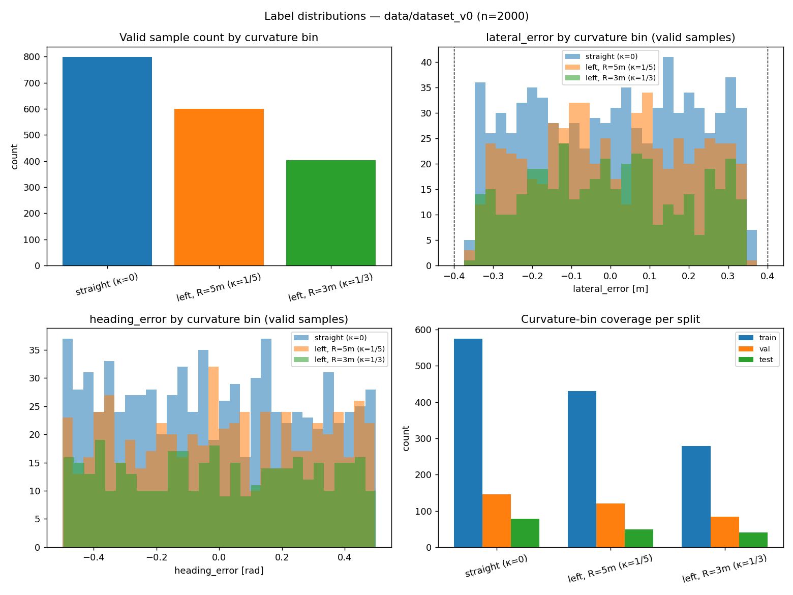

# Dataset — M1

**Location:** `data/dataset_v0/` (git-ignored — regenerate locally, see below)
**Status:** Generated, split, and validated programmatically. See [`docs/decisions.md`](decisions.md) ADR-7, ADR-8, ADR-9 for the defects this process caught before training started.

---

## 1. What it is

2000 synthetic camera frames from a vehicle-mounted MuJoCo camera on `REFERENCE_TRACK` (a 45.13 m closed loop, see [`perception/dataset/track_definitions.py`](../perception/dataset/track_definitions.py)), each labeled with the ground-truth `/lane_state` the vehicle would have seen from that pose — the contract defined in [`docs/lane-state-contract.md`](lane-state-contract.md).

| | |
|---|---|
| Total samples | 2000 |
| Images | `data/dataset_v0/images/img_NNNNN.png`, 320×240 RGB, ~19.9 MB total |
| Labels | `data/dataset_v0/labels.csv`, ~305 KB |
| Valid (`valid=True`) | 1800 (90%) — vehicle in-lane, lane visible ahead |
| Invalid (`valid=False`) | 200 (10%) — vehicle far off track, no lane marking anywhere in frame (confidence-head negatives) |
| Split | train 1421 (71.1%) / val 386 (19.3%) / test 193 (9.7%) |

## 2. Label schema (`labels.csv`)

| Column | Meaning |
|---|---|
| `filename` | image file in `images/` |
| `x`, `y`, `heading` | vehicle pose used to render the frame (world frame) |
| `s` | arc length of the projection point on the centerline |
| `lateral_error`, `heading_error`, `curvature` | the `/lane_state` ground truth at that pose — see the contract for sign conventions |
| `confidence`, `valid` | confidence-head training target; `valid = confidence >= 0.5` |
| `split` | `train` / `val` / `test` |

## 3. Distribution



Curvature only takes three values on this track (κ = 0, 1/5, 1/3 — the two arc radii), and every one of them is present in every split by construction (ADR-9) — verified by `test_every_curvature_bin_present_in_every_split`. `lateral_error` and `heading_error` are close to uniform across their declared envelopes for every curvature bin (no bias toward straight-line samples). Negative samples average 6.10 m off centerline (min 2.03 m, max 10.0 m) — deliberately easy negatives; see ADR-8 for why.

Regenerate this figure and its console breakdown (per-split, per-curvature-bin counts) with:

```bash
python3 perception/dataset/plot_label_distributions.py
```

## 4. Normalization statistics

Per-channel mean/std, computed over the **train split only** (val/test stay unseen at the pixel-statistics level, not just at the label level), written to [`perception/dataset/normalization_stats.json`](../perception/dataset/normalization_stats.json):

```json
{
  "mean": [0.4298, 0.4899, 0.5642],
  "std":  [0.3188, 0.3696, 0.4291]
}
```

(RGB, `[0, 1]` scale.) Both training (M2) and `perception_node`'s inference-time preprocessing must load these from the same file rather than recomputing or hard-coding them — that consistency is NFR-8.

Regenerate with:

```bash
python3 perception/dataset/compute_normalization_stats.py
```

## 5. Reproducing the dataset exactly

Generation is seeded (`SEED = 42`) and deterministic — see `test_generation_is_deterministic`. From the repo root, with the sim venv active:

```bash
source venv/bin/activate
python3 perception/dataset/generate_dataset.py       # labels.csv (headless, ~instant)
python3 perception/dataset/render_dataset_images.py  # images/ (MuJoCo offscreen render, Mac-only, ~30s for 2000 frames)
python3 perception/dataset/plot_label_distributions.py
python3 perception/dataset/compute_normalization_stats.py
```

`generate_dataset.py` has no MuJoCo dependency and is fully covered by `tests/test_generate_dataset.py`; `render_dataset_images.py` only turns already-decided poses into pixels and carries no sampling logic of its own, so a rendering bug can never be confused with a labeling bug (see the module docstrings).

## 6. Validation performed

- `python3 -m pytest tests/ -q` — 29/29 passing, including label envelope, camera-visibility ground truth (`lane_is_visible`/`any_lane_visible` against every generated pose, not a resample), split-purity (`zone_for_s`), and curvature-coverage-per-split regression tests.
- Every row's stored label recomputed independently from `(x, y, heading)` and diffed against the CSV (agrees to 1e-9).
- Every image file checked for correct dimensions and non-degenerate pixel content; CSV rows and image files verified 1:1.
- No cross-split leakage: split is a pure function of `zone_for_s(s)`; nearest cross-split neighbor in arc length checked directly (closest pair ~6 mm in `s`, but differs by ≥0.1 m in `lateral_error` and/or ≥0.1 rad in `heading_error` — not a near-duplicate).
